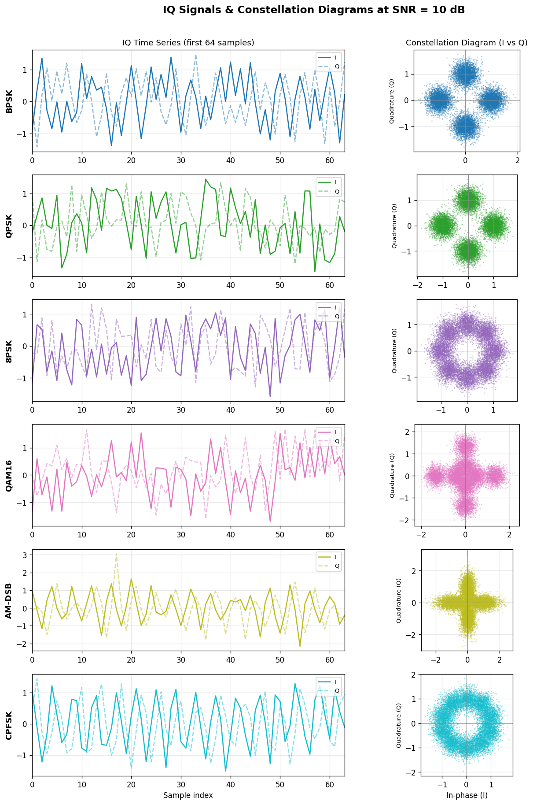
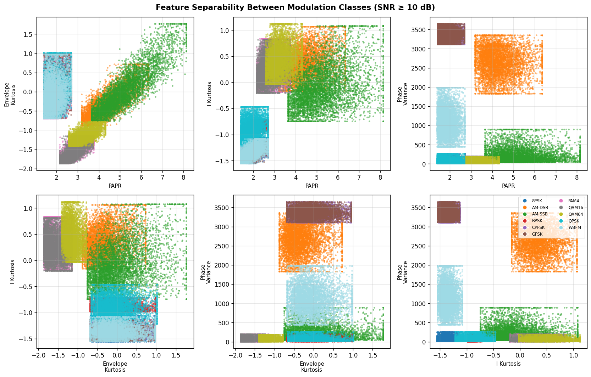
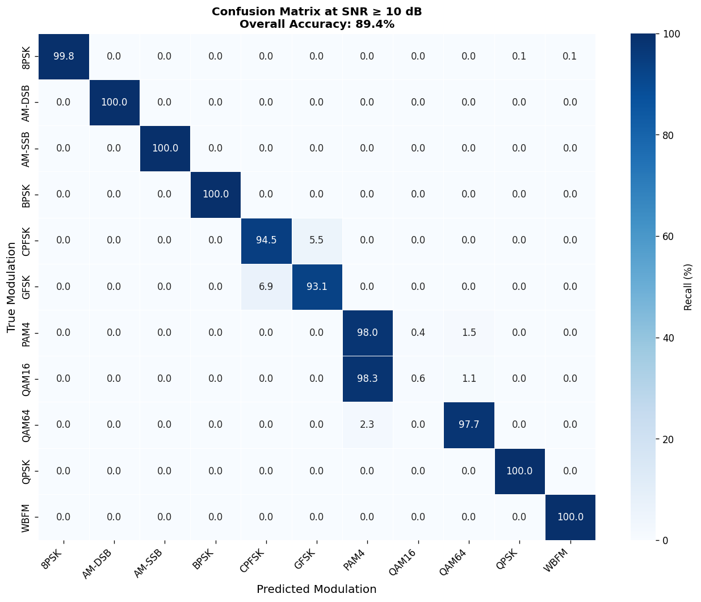
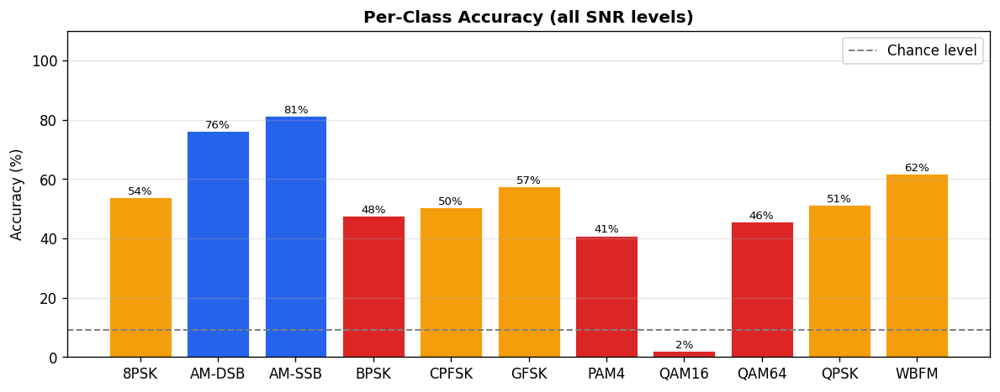
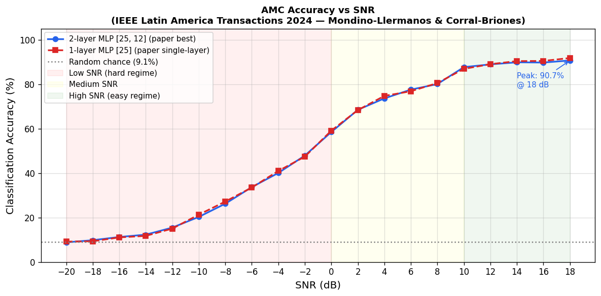
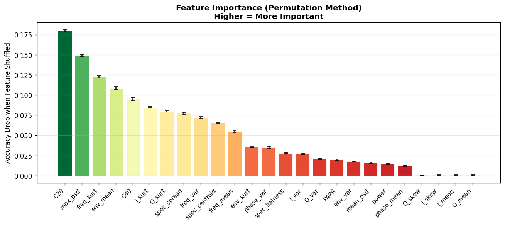

# Automatic Modulation Classification for Low-Power IoT Applications

A lightweight **Automatic Modulation Classification (AMC)** system for identifying digital and analog modulation schemes from wireless IQ signal samples using statistical signal features and a compact neural network.

The project is based on the methodology presented in the paper **“Automatic Modulation Classification for Low-Power IoT Applications”** by Yasmín R. Mondino-Llermanos and Graciela Corral-Briones, published in *IEEE Latin America Transactions*, Vol. 22, No. 3, March 2024. This repository implements and evaluates the core feature-engineering and lightweight neural-network approach described in the paper.

---

## Overview

Wireless communication systems use different modulation schemes to encode information onto carrier signals. **Automatic Modulation Classification** determines the modulation type of an incoming signal without requiring prior knowledge of the transmitter configuration.

This project focuses on a resource-efficient approach suitable for **low-power and resource-constrained IoT environments**.

This project follows a feature-based approach:

```text
Raw IQ Samples
      │
      ▼
Signal Preprocessing
      │
      ▼
25 Statistical & Signal Features
      │
      ▼
Feature Scaling
      │
      ▼
Lightweight MLP Classifier
      │
      ▼
11 Modulation Classes
```

The implementation focuses on reducing the computational input size while retaining useful characteristics of the received signal.

---

## Key Features

* Classification of **11 digital and analog modulation schemes**
* Uses **IQ signal samples** as the input
* Extracts **25 engineered statistical and signal-processing features**
* Reduces each sample from **256 raw IQ values to 25 features**
* Lightweight MLP architecture suitable for resource-constrained applications
* Evaluation across multiple SNR levels
* Confusion matrix and per-class accuracy analysis
* SNR-dependent performance analysis
* Feature importance analysis
* Signal and feature visualizations

---

## Supported Modulation Schemes

| #  | Modulation |
| -- | ---------- |
| 1  | BPSK       |
| 2  | QPSK       |
| 3  | 8PSK       |
| 4  | QAM16      |
| 5  | QAM64      |
| 6  | CPFSK      |
| 7  | GFSK       |
| 8  | AM-DSB     |
| 9  | AM-SSB     |
| 10 | PAM4       |
| 11 | WBFM       |

---

## Dataset

The implementation is based on the **RadioML 2016.10A** dataset structure.

### Dataset characteristics

| Property                         |            Value |
| -------------------------------- | ---------------: |
| Modulation classes               |               11 |
| SNR levels                       |               20 |
| SNR range                        | -20 dB to +18 dB |
| SNR step                         |             2 dB |
| Examples per modulation/SNR pair |            1,000 |
| Total examples                   |          220,000 |
| IQ samples per example           |              128 |
| Raw values per example           |              256 |

Each signal example contains:

```text
I channel → 128 samples
Q channel → 128 samples

Total → 256 raw values
```

### Dataset availability

The notebook attempts to use the `RML2016.10a_dict.pkl` dataset.

If the original dataset is unavailable, the notebook contains a synthetic-data generation path that reproduces the expected dataset structure for experimentation.

**Important:** results obtained from synthetic data should not be interpreted as results obtained directly from the original RadioML dataset.

---

# Feature Engineering

Instead of feeding all 256 raw IQ values directly into the classifier, the project extracts **25 engineered features**.

The features capture different characteristics of the received signal.

### Feature categories

#### Time-domain features

* I/Q mean
* I/Q variance
* Skewness
* Kurtosis

#### Amplitude features

* Envelope mean
* Envelope variance
* Envelope kurtosis
* Peak-to-Average Power Ratio (PAPR)

#### Phase features

* Phase statistics
* Phase variation characteristics

#### Spectral features

* Frequency-domain statistics
* Maximum PSD
* Mean PSD
* Spectral centroid
* Spectral spread
* Spectral flatness

#### Higher-order statistics

* Signal cumulants
* Distribution-related characteristics

### Dimensionality reduction

```text
Raw IQ representation
256 values
    │
    ▼
Feature extraction
    │
    ▼
25 engineered features
```

This reduces the feature representation to approximately **9.8% of the original input size**.

---

# Machine Learning Model

The project uses a lightweight **Multi-Layer Perceptron (MLP)** classifier.

### Architecture

```text
Input Layer
25 Features
     │
     ▼
Dense Layer
25 Neurons
ReLU
     │
     ▼
Dense Layer
12 Neurons
ReLU
     │
     ▼
Output Layer
11 Neurons
Softmax
```

### Model configuration

| Parameter            | Value      |
| -------------------- | ---------- |
| Input features       | 25         |
| Hidden layer 1       | 25 neurons |
| Hidden layer 2       | 12 neurons |
| Output classes       | 11         |
| Hidden activation    | ReLU       |
| Output activation    | Softmax    |
| Optimizer            | Adam       |
| Learning rate        | 0.001      |
| Trainable parameters | 1,105      |

The compact architecture keeps the model relatively small compared with deep neural network approaches that operate directly on raw IQ data.

---

# Training Pipeline

The complete training pipeline is:

```text
IQ Dataset
    │
    ▼
Signal Feature Extraction
    │
    ▼
25 Engineered Features
    │
    ▼
Stratified Train/Test Split
    │
    ├───────────────┐
    ▼               ▼
Training Set      Test Set
    │               │
    ▼               │
StandardScaler      │
    │               │
    ▼               │
MLP Training        │
    │               │
    └───────┬───────┘
            ▼
       Predictions
            │
            ▼
 Accuracy / F1 / Confusion Matrix
```

### Train/Test Split

The dataset is divided using an **80/20 stratified split**:

* Training samples: **176,000**
* Test samples: **44,000**

Feature scaling is fitted on the training data and then applied to the test data.

---

# Results

The reported implementation achieved the following overall results:

| Metric                  |     Result |
| ----------------------- | ---------: |
| Overall Accuracy        | **51.68%** |
| Weighted F1 Score       | **0.4990** |
| Accuracy at SNR ≥ 10 dB | **89.38%** |

Performance varies substantially with SNR. Classification becomes considerably more difficult at low SNR because noise makes the statistical and spectral characteristics of different modulation schemes less distinguishable.

---

# Visualizations

The repository contains visualizations generated during the experiment.

## Signal Gallery

Examples of the analyzed modulation signals and their IQ characteristics.



---

## Feature Scatter

Visualization of the extracted feature space for different modulation classes.



---

## Confusion Matrix

The confusion matrix shows classification behavior across the 11 modulation classes.



A notable confusion pattern in the implementation is between **8PSK and QPSK**, particularly under lower-SNR conditions.

---

## Per-Class Accuracy

Classification accuracy for each modulation class.



---

## Accuracy vs SNR

The relationship between classification accuracy and signal-to-noise ratio.



The classifier performs substantially better at higher SNR levels, with the reported accuracy reaching **89.38% for SNR ≥ 10 dB**.

---

## Feature Importance

Permutation-based feature importance is used to analyze the contribution of engineered features to classification performance.



This provides an interpretable view of which signal characteristics are most useful to the classifier.

---

# Performance by SNR

SNR has a strong influence on AMC performance.

```text
Low SNR
   │
   │  Signal characteristics obscured by noise
   ▼
Lower classification accuracy
   │
   │
   ▼
Higher SNR
   │
   │  Signal characteristics become more distinguishable
   ▼
Higher classification accuracy
```

The implementation reports:

* Significant degradation at low SNR
* Rapid improvement as SNR increases
* Stronger classification performance at SNR ≥ 10 dB
* Increased confusion between similar modulation schemes at low SNR

---

# Technologies Used

### Programming

* Python
* Jupyter Notebook

### Machine Learning

* Scikit-learn
* MLP Classifier
* StandardScaler
* Train/Test Split
* Classification Metrics

### Signal Processing

* NumPy
* SciPy
* Statistical signal analysis
* Power spectral density analysis
* Higher-order statistics

### Visualization

* Matplotlib
* Seaborn

### Data Processing

* Pickle
* NumPy arrays

---

# Installation

Clone the repository:

```bash
git clone https://github.com/suke2004/amc-iot-ieee2024.git
cd amc-iot-ieee2024
```

Install the required Python packages:

```bash
pip install numpy scipy scikit-learn matplotlib seaborn jupyter
```

Launch the notebook:

```bash
jupyter notebook amc_iot_ieee2024.ipynb
```

---

# Running the Project

1. Clone the repository.
2. Install the required Python dependencies.
3. Place the RadioML dataset in the expected location if available.
4. Open `amc_iot_ieee2024.ipynb`.
5. Run the notebook sequentially.
6. The notebook performs:

   * Dataset loading
   * Signal preprocessing
   * Feature extraction
   * Feature scaling
   * Model training
   * Prediction
   * Accuracy evaluation
   * Confusion matrix generation
   * SNR analysis
   * Feature importance analysis

---

# Repository Structure

```text
.
├── LICENSE
├── README.md
│
├── amc_iot_ieee2024.ipynb
│
├── signal_gallery.png
├── feature_scatter.png
├── confusion_matrix.png
├── per_class_accuracy.png
├── accuracy_vs_snr.png
└── feature_importance.png
```

---

# Research Reference

This implementation is based on:

**Yasmín R. Mondino-Llermanos and Graciela Corral-Briones**

*Automatic Modulation Classification for Low-Power IoT Applications*

IEEE Latin America Transactions, Volume 22, Number 3, March 2024.

DOI:

```text
10.1109/TLA.2024.10431424
```

---

# Limitations

The current implementation has several practical limitations:

* Performance decreases significantly at low SNR.
* Similar modulation schemes can be difficult to distinguish.
* The approach depends on manually engineered signal features.
* The lightweight architecture trades model complexity for computational efficiency.
* Synthetic data generated by the notebook, when used, should not be treated as equivalent to the original RadioML dataset.
* The current implementation is primarily an experimental notebook rather than a deployment-ready embedded inference system.

---

# Future Improvements

Potential extensions include:

* Evaluation directly on additional real-world RF datasets
* Deep learning models operating directly on IQ samples
* CNN-based modulation classification
* Lightweight 1D CNN architectures for edge devices
* Quantization for embedded deployment
* Model compression and pruning
* Real-time SDR integration
* Streaming IQ signal classification
* Evaluation on additional wireless standards and channel conditions

---

# Project Objective

The primary objective is to investigate whether a compact set of statistical and signal-processing features can provide useful modulation classification performance while keeping the machine learning model lightweight.

The project therefore combines:

```text
Wireless Signal Processing
          +
Feature Engineering
          +
Machine Learning
          +
SNR Analysis
          +
Lightweight Classification
```

for an AMC workflow relevant to **low-power and resource-constrained IoT systems**.

---

# Acknowledgements

This project was implemented based on the methodology described in the referenced IEEE publication and uses the RadioML 2016.10A dataset structure for experimentation.

---

## Author

**Mahalaxmi Karnti**

Electronics and Communication Engineering
NIT Trichy

[GitHub](https://github.com/KarnatiMahalaxmi)
